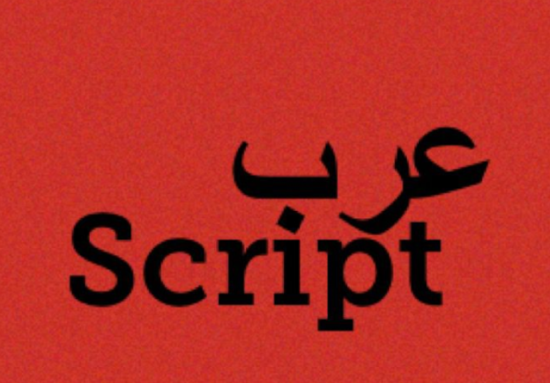

# ArabScript


## Introduction

One of my biggest insecurities is the fact that I cannot really speak arabic, at least in comparison to my peers back home. My arabic is broken and I instinctively refrain from speaking in it because I feel embarrassed. This allows me to sympathize with Arabs who cannot speak english. I believe there is an untapped potential from the arab communities to do wonderful things in the field of computer science, but they are restricted because of the language barrier. As such, I have decided to spend this semester working on ArabScript, an arabic programming language.


There are two people in particular that I would like to thank. First, Dr. Ray Toal for mentoring and teaching me; without him, I could never do such an amazing project. And the second person I’d like to thank is, my best friend, Omar Abdulatif; since I cannot speak arabic, I had him help me design the syntax so that it could be in classical arabic. The reason why we want it to be written with classical arabic is because we want our audience to be broad and not limited to people who speak in certain dialects.


## Features

- Dynamically typed language
- Variables
- Built-in Functions like typeof and print
- Ternary
- Try Catch
- If statements
- For/for of statements
- While/do while statements
- Switch statements
- Functions
- Classes

## Data Types

- Strings
- Numbers
- Booleans
- Objects
- Undefined
- Null

## Types of Semantic Errors
- Type mismatch
- Assignment to constant variable
- Return statements can only be used in a function
- Continue/Break can only be used in a loop
- This keyword can only be used in a class
- Is callable
- Is a number
- Is an integer
- Is a boolean
- Is an array or dictionary
- All keys are unique


## Keywords

| JavaScript  | arabScript |
| ----------- | ---------- |
| break       | قف         |
| case        | حالة       |
| catch       | مسك        |
| class       | صنف        |
| const       | ثابت       |
| constructor | منشئ       |
| continue    | استمر      |
| default     | خلاف ذلك    |
| do          | افعل       |
| else        | آخر        |
| else if     | ولو        |
| false       | خطا        |
| for         | ل          |
| function    | دالة       |
| if          | لو         |
| let         | دع         |
| new         | جديد       |
| null        | نل         |
| of          | من         |
| print       | طبع        |
| return      | عد         |
| switch      | تبديل      |
| this        | هذا        |
| true        | صح         |
| typeof      | نوع        |
| undefiend   | مجهول      |
| var         | متغير      |
| while       | بينما      |


## Variable Declaration and Assignment

| JavaScript      | arabScript      |
| --------------- | --------------- |
| let x = 10;     | ١٠؛ = x دع      |
| var y = "hi";   | ؛"hi" = y متغير |
| const z = 4.20; | ٤.٢٠؛ = z ثابت  |

## Built In Functions

<table>
<tr>
<td> <h3>JavaScript</h3> </td> <td> <h3>ArabScript</h3> </td>
</tr>
<tr>
<td>
console.log("Hello, World!");
</td>
<td dir="rtl">
    طبع("Hello, World!")؛
</td>
</tr>
<tr>
<td>
typeof a;
</td>
<td dir="rtl">
    نوع(ا)؛
</td>
</tr>
</table>

## Ternary

<table>
<tr>
<td> <h3>JavaScript</h3> </td> <td> <h3>ArabScript</h3> </td>
</tr>
<tr>
<td>
1 ? 2 : 3;
</td>
<td dir="rtl">
    ١ ؟ ٢ : ٣؛
</td>
</tr>
</table>

## Try Catch

<table>
<tr>
<td> <h3>JavaScript</h3> </td> <td> <h3>ArabScript</h3> </td>
</tr>
<tr>
<td>

```JavaScript

    let var_1 = {};
    try {
        var_1.feature.feature;
    } catch(mistake) {
        onsole.log(mistake);
    }


```

</td>

<td dir="rtl">
    <pre>
    دع ا = {}؛
    { ا.خاصية.خاصية؛ } مسك(غلطة) { طبع(غلطة)؛ }
    </pre>
</td>
</tr>
</table>


## Control Flow

<table>
<tr>
<td> <h3>Programming Feature</h3>      </td><td> <h3>JavaScript</h3> </td> <td> <h3>ArabScript</h3> </td>
</tr>
<tr>
<td> If/Else </td>
<td>

```JavaScript

    let noun = "خالد";
    if ((noun === "خالد")) {
        console.log("What a lad");
    } else if (((noun === "نور") || (noun === "بدر"))) {
        console.log("Meh");
    } else {
        console.log("Not a sibling");
    }

```
</td>
<td dir="rtl"> 
	<pre>

	دع اسم = "خالد"؛
    لو(اسم == "خالد"){
        طبع("What a lad")؛
    }ولو(اسم == "نور" || اسم == "بدر"){
        طبع("Meh")؛
    }آخر{
        طبع("Not a sibling")؛
    }
    </pre>
</td>

</tr>

<tr>
<td> For Loops </td>
<td>

```JavaScript
for (let number = 1; (number <= 5); number++) {
    console.log(number);
}

let numbers = [1,2,3,4,5];
for (const number of numbers) {
    console.log(number);
}

```

</td>
<td dir="rtl"> 
    <pre>
ل(دع رقم = ١؛ رقم<=٥؛رقم++){
        طبع(رقم)؛
    }

    دع ارقام = [١،٢،٣،٤،٥]؛
    ل(رقم من ارقام){
        طبع(رقم)؛
    }
</pre>
</td>

	
</tr>

<tr>
<td> While Loops </td>
<td>

```JavaScript
function countdown(number) {
    console.log("Begin countdown!");
    while ((number > 0)) {
        console.log(number);
        number--;
    }
    console.log("Blast off!");
}
do {
    countdown(10);
} while (false);

```

</td>
<td dir="rtl"> 
    <pre>
دالة العد&التنازلي(عدد){
    طبع("Begin countdown!")؛
    بينما(عدد > ٠){
        طبع(عدد)؛
        عدد--؛
    }
    طبع("Blast off!")؛
}
افعل{
    العد&التنازلي(١٠)؛
}بينما(خطا)؛


</pre>
</td>

</tr>

<tr>
<td> Switch </td>
<td>

```JavaScript
let noun = "خالد";
switch(noun) {
    case "خالد":
        console.log("Lead Programmer");
        break;
    case "عمر":
        console.log("Syntax Designer");
        break;
    case "راي تول":
        console.log("Mentor");
        break;
    default: console.log("Morale support");
}


```

</td>
<td dir="rtl"> 
    <pre>
دع اسم = "خالد"؛
تبديل(اسم){
    حالة "خالد":
        طبع("Lead Programmer")؛
        قف؛
    حالة "عمر":
        طبع("Syntax Designer")؛
        قف؛
    حالة "راي تول":
        طبع("Mentor")؛
        قف؛
    خلاف ذلك: طبع("Morale support")؛
}


</pre>
</td>

</tr>

</table>

## Functions

<table>
<tr>
<td> <h3>JavaScript</h3> </td> <td> <h3>ArabScript</h3> </td>
</tr>
<tr>
<td>

```JavaScript
function fibonacci(var_1) {
    if ((var_1 <= 1)) {
        return var_1;
    }
    return (fibonacci((var_1 - 1)) + fibonacci((var_1 - 2)));
}
```

</td>
<td dir="rtl">
    <pre>
    دالة فيبوناتشي(ن){
        لو(ن <= ١){
            عد ن؛
        }
        عد فيبوناتشي(ن-١) + فيبوناتشي(ن-٢)؛
    }
    </pre>
</td>
</tr>
</table>

## Classes

<table>
<tr>
<td> <h3>JavaScript</h3> </td> <td> <h3>ArabScript</h3> </td>
</tr>
<tr>
<td>

```JavaScript
class dog{
    constructor (noun, age){
        this.noun = noun;
        this.age = age;
    }
    function bless() {
        console.log("ووف");
    }
}
let khaled = new dog("خالد", 7);
khaled.noun = "احمد";
khaled.bless();
```

</td>
<td dir="rtl">
    <pre>
    صنف كلب {
        منشئ(اسم،عمر){
            اسم هذا = اسم؛
            عمر هذا = عمر؛
        }
        دالة بارك(){
            طبع("ووف")؛
        }
    }
    دع خالد = كلب("خالد"،٧) جديد؛
    خالد.اسم = "احمد"؛
    خالد. بارك()؛
    </pre>
</td>
</tr>
</table>

## Example Programs

### Hello World
<table>
<tr>
<td> <h3>JavaScript</h3> </td> <td> <h3>ArabScript</h3> </td>
</tr>
<tr>
<td>

```JavaScript
console.log("Hello World");
```

</td>
<td dir="rtl">
    <pre>
    طبع("Hello World")؛
    </pre>
</td>
</tr>
</table>

### Add

<table>
<tr>
<td> <h3>JavaScript</h3> </td> <td> <h3>ArabScript</h3> </td>
</tr>
<tr>
<td>

```JavaScript
function add(var_1, var_2) {
    return (var_1 + var_2);
}
```

</td>
<td dir="rtl">
    <pre>
    دالة اضف(ا،ب){
        عد ا+ب؛
    }
    </pre>
</td>
</tr>
</table>

### Node Class

<table>
<tr>
<td> <h3>JavaScript</h3> </td> <td> <h3>ArabScript</h3> </td>
</tr>
<tr>
<td>

```JavaScript
class node{
    constructor (data, next){
        this.data = data;
        this.next = next;
    }
    function next_set(next) {
        this.next = next;
    }
    function data_set(data) {
        this.data = data;
    }
    function get_next() {
        return this.next;
    }
    function get_data() {
        return this.data;
    }
}
```

</td>
<td dir="rtl">
    <pre>
    صنف العقدة {
        منشئ(البيانات، تالي){
            البيانات هذا = البيانات؛
            تالي هذا = تالي؛
        }
        دالة تعيين&تالي(تالي){
            تالي هذا = تالي؛
        }
        دالة تعيين&البيانات(البيانات){
            البيانات هذا = البيانات؛
        }
        دالة احصل&تالي(){
            عد تالي هذا؛
        }
        دالة احصل&البيانات(){
            عد البيانات هذا؛
        }
    }
    </pre>
</td>
</tr>
</table>

